<!-- Profile Header -->
<!-- Visuals -->

  

---

## 📚 Table of Contents
- [About Me](#-about-me)
- [Highlights](#-highlights)
- [Skill Set](#-skill-set)
  - [Languages & Runtime](#-languages--runtime)
  - [Frontend](#-frontend)
  - [Backend & APIs](#-backend--apis)
  - [Databases & Data](#-databases--data)
  - [Cloud, DevOps & Observability](#-cloud-devops--observability)
  - [Testing & Quality](#-testing--quality)
  - [Artificial Intelligence & Machine Learning](#-artificial-intelligence--machine-learning)
  - [Mobile & Multiplatform](#-mobile--multiplatform)
- [Modern Full‑Stack Frameworks & Stacks](#-modern-full-stack-frameworks--stacks)
- [Featured Tech Stack Playbooks](#-featured-tech-stack-playbooks)
- [Architecture Overview](#-architecture-overview)

## 👨‍💻 About Me
🔭 I design and ship production‑ready web platforms with modern DX, performance, and accessibility at the core.
🤖 I specialize in integrating LLMs, RAG, and automation into real products—safely and observably.
🧩 I bridge frontend, backend, data, and DevOps to deliver cohesive, measurable outcomes.
🤝 Open to AI‑powered SaaS, platform engineering, and OSS collaboration.

---

## ✨ Highlights

- 🚀 End‑to‑end delivery: from idea to production with measurable outcomes
- 🧠 AI‑augmented apps: LLMs, RAG, prompt telemetry, safety guardrails
- ⚡ Performance‑first: edge rendering, caching strategy, profiling & budgets
- 🔒 Secure by default: authN/Z, secrets, threat‑modeling, least‑privilege IaC
- 🔁 DevEx & speed: monorepos, codegen, CI/CD previews, trunk‑based flow

---

## 🛠 Skill Set

### 🌐 Languages & Runtime

  
  
  
  
  

### 🖥 Frontend

  
  
  
  
  
  
  
  
  
  

### 🧱 Backend & APIs

  
  
  
  
  
  
  
  
  

### 🗄 Databases & Data

  
  
  
  
  
  
  
  
  

### ☁️ Cloud, DevOps & Observability

  
  
  
  
  
  
  
  
  
  
  
  

### 🧪 Testing & Quality

  
  
  
  

### 🤖 Artificial Intelligence & Machine Learning

  
  
  
  
  
  
  
  
  

### 📱 Mobile & Multiplatform

  
  

  

---

## ⚡ Modern Full‑Stack Frameworks & Stacks

  
  
  
  
  
  
  
  
  
  

  <table width="100%">
    <tr>
      <td width="60%" style="padding: 10px; text-align: left; vertical-align: top;">
        <b>What I deliver</b> 
        ✅ Production‑grade full‑stack apps (edge‑ready, SSR/ISR, server actions) 
        ✅ RAG‑enabled features (secure retrieval, evals, guardrails) 
        ✅ CI/CD with preview deployments and feature environments 
        ✅ Observability (traces, logs, APM) and performance budgets 
      </td>
      <td width="40%" style="padding: 10px; text-align: center;">
        
      </td>
    </tr>
  </table>

---

## 🧩 Featured Tech Stack Playbooks

### SaaS/Web App (Edge‑ready, Production)
- Frontend: Next.js App Router (SSR/ISR, Server Actions), Tailwind CSS, TanStack Query
- API: tRPC or GraphQL, Zod validation, Server Components
- Data: PostgreSQL (Prisma), Redis (rate limiting, cache), S3/Cloudflare R2
- Auth & Payments: Auth.js/Clerk, Stripe, Webhooks (svix)
- DevOps: Vercel (Preview envs), GitHub Actions, Sentry + OpenTelemetry

### AI Product (RAG + Agents)
- Inference: OpenAI/Anthropic, Vercel AI SDK or LangChain
- Retrieval: Pinecone or FAISS, hybrid search (Elasticsearch), chunking + embeddings
- Orchestration: Background jobs (BullMQ/Temporal), observability traces for prompts
- Safety/Evals: Guardrails, prompt/response logging, offline evals

### Real‑time Apps (Chats/Collab/Dashboards)
- Backend: NestJS (WebSockets), Kafka/NATS for event streaming, CQRS where useful
- State: Redis pub/sub, Postgres logical replication for read models
- UI: React/Next.js + Presence/CRDTs as needed (yjs/automerge)

### E‑commerce/Content
- Web: Remix or Next.js, SEO‑first routing, edge caching
- Commerce: Stripe/Shopify Storefront API, Medusa (headless)
- Content: Sanity/Contentful, image pipelines (Cloudflare Images/Vercel OG)

### Data & Analytics Platforms
- Services: FastAPI/Django, Celery/RQ workers
- Storage: Postgres, ClickHouse (analytics), Lake (S3/R2)
- Pipeline: Airflow/Prefect, dbt, ELT into warehouse + semantic layer

### Mobile
- Expo + React Native, tRPC/GraphQL to backend, OTA updates (EAS)

---

## 🏗️ Architecture Overview

```mermaid
graph LR
  A["Client Apps\nWeb · Mobile"] --> B["Edge Layer\nCDN · WAF · Functions"]
  B --> C["Web Server\nNext.js · Remix"]
  B --> D["API Layer\nNestJS · FastAPI"]
  C --> D
  D --> E["Workers & Queues\nBullMQ · Temporal"]
  D --> F["Databases\nPostgres · MongoDB"]
  D --> G["Caches\nRedis"]
  D --> H["Vector Store\nPinecone · FAISS"]
  D --> I["Search\nElasticsearch"]
  D --> J["Object Storage\nS3 · R2"]
  D --> K["Observability\nOpenTelemetry → Sentry/Datadog"]
```

---

## 🤝 Get in Touch

If you’re building something interesting (SaaS, AI features, platforms), I’d love to collaborate. Reach out via GitHub.

---
